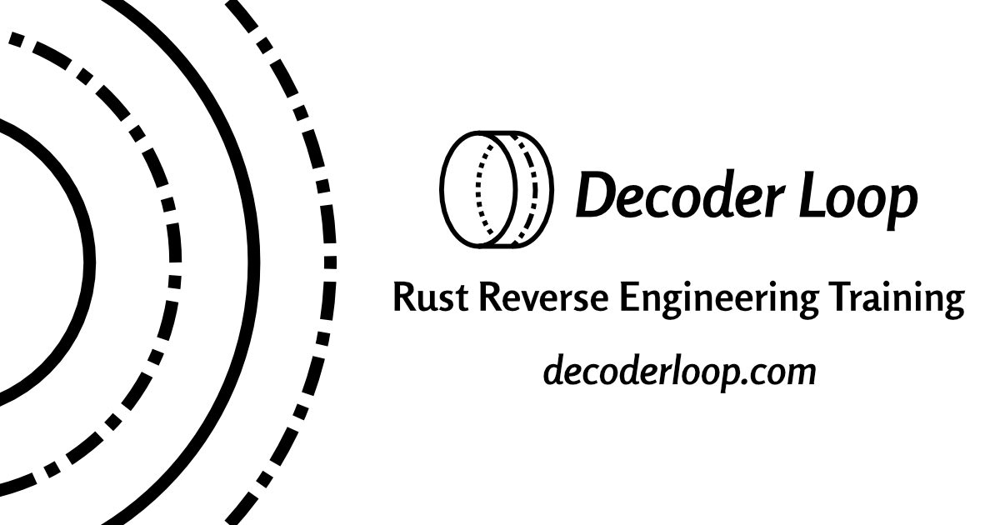

# Decoder Loop

🌐 [decoderloop.com](https://decoderloop.com)

Malware authors are using modern programming languages like Rust and Go, but reverse engineers are still catching up. The tools and techniques we have were built for a different era.

Decoder Loop is here to raise the bar for binary reverse engineering training.
